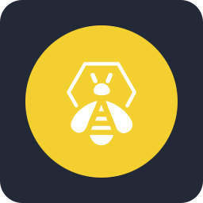

# KALLISTO

### Cybersecurity · AI Agents · Quant Systems · Automation · Infrastructure

---

## `01 / Playground`

<kbd>🛡️ SECURITY</kbd>&nbsp;&nbsp; <kbd>🤖 AGENTIC AI</kbd>&nbsp;&nbsp; <kbd>📈 QUANT</kbd>&nbsp;&nbsp; <kbd>🧱 INFRA</kbd>&nbsp;&nbsp; <kbd>⚙️ AUTOMATION</kbd>

 

Exploring systems that detect, reason, automate, orchestrate and execute.

---

## `02 / Areas`

<table>
<tr>
<td width="25%" align="center" valign="top">

### 🛡️ Cybersecurity
Detection · Incident Response · SIEM/SOAR · DFIR · Threat Intelligence

</td>
<td width="25%" align="center" valign="top">

### 🤖 AI Agents
Local Models · Tool Use · Orchestration · Autonomous Workflows

</td>
<td width="25%" align="center" valign="top">

### 📈 Quant
Market Data · Research · Backtesting · Execution Systems

</td>
<td width="25%" align="center" valign="top">

### 🧱 Infrastructure
Containers · Kubernetes · Virtualization · Networking · Self-hosting

</td>
</tr>
</table>

---

## `03 / Toolbox`

  

&nbsp;

---

## `04 / Building`

<code>security automation</code>&nbsp;&nbsp;·&nbsp;&nbsp;<code>local AI agents</code>&nbsp;&nbsp;·&nbsp;&nbsp;<code>quant research</code>&nbsp;&nbsp;·&nbsp;&nbsp;<code>self-hosted systems</code>

---

## `05 / GitHub activity`

<picture>
  <source media="(prefers-color-scheme: dark)" srcset="https://raw.githubusercontent.com/KALLISTTO/KALLISTTO/output/github-contribution-grid-snake-dark.svg" />
  <source media="(prefers-color-scheme: light)" srcset="https://raw.githubusercontent.com/KALLISTTO/KALLISTTO/output/github-contribution-grid-snake.svg" />
  
</picture>

---

<code>KALLISTO // SECURITY · AI · QUANT · AUTOMATION · BUILD</code>

