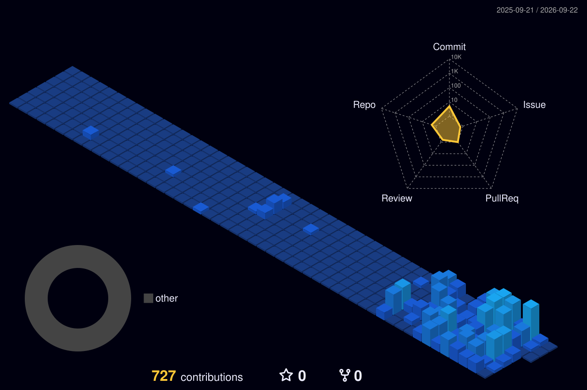

<div align="center">

# KALLISTO

### Cybersecurity · AI Agents · Quant Systems · Automation · Infrastructure

Building, experimenting and learning across security, intelligent systems and self-hosted infrastructure.

[](https://github.com/KALLISTTO)

</div>

---

## `01 / Explore`

I like building systems at the intersection of **cybersecurity, AI, automation, infrastructure and quantitative research**.

```text
> secure
> automate
> orchestrate
> experiment
> build
```

---

## `02 / Areas`

<table>
<tr>
<td width="25%" valign="top">

### 🛡️ Cybersecurity
Detection, incident response, SIEM/SOAR, DFIR, threat intelligence and security engineering.

</td>
<td width="25%" valign="top">

### 🤖 AI Agents
Local models, tool use, agent orchestration, automation and autonomous workflows.

</td>
<td width="25%" valign="top">

### 📈 Quant
Market data, strategy research, backtesting, execution tooling and systematic experimentation.

</td>
<td width="25%" valign="top">

### 🧱 Infrastructure
Containers, orchestration, networking, virtualization, self-hosting and observability.

</td>
</tr>
</table>

---

## `03 / Toolbox`

<div align="center">


<br/><br/>


&nbsp;&nbsp;&nbsp;&nbsp;

&nbsp;&nbsp;&nbsp;&nbsp;

&nbsp;&nbsp;&nbsp;&nbsp;

&nbsp;&nbsp;&nbsp;&nbsp;


<br/><br/>

`Kubernetes` · `Ollama` · `TheHive` · `Docker` · `Proxmox` · `n8n` · `Linux` · `Python`

</div>

---

## `04 / Building`

- security automation and detection tooling
- AI agents and local-model workflows
- quantitative research and trading infrastructure
- self-hosted services, homelabs and distributed systems
- experiments that connect all of the above

---

## `05 / GitHub activity`

<div align="center">


</div>

### 3D contribution map

<div align="center">



</div>

### Contribution snake

<picture>
  <source media="(prefers-color-scheme: dark)" srcset="https://raw.githubusercontent.com/KALLISTTO/KALLISTTO/output/github-contribution-grid-snake-dark.svg" />
  <source media="(prefers-color-scheme: light)" srcset="https://raw.githubusercontent.com/KALLISTTO/KALLISTTO/output/github-contribution-grid-snake.svg" />
  
</picture>

---

<div align="center">

```text
KALLISTO // SECURITY · AI · QUANT · AUTOMATION · BUILD
```

</div>
